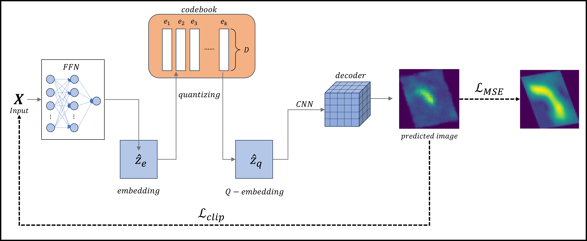
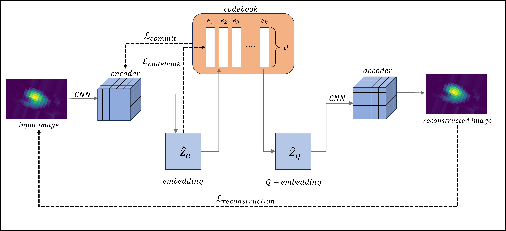
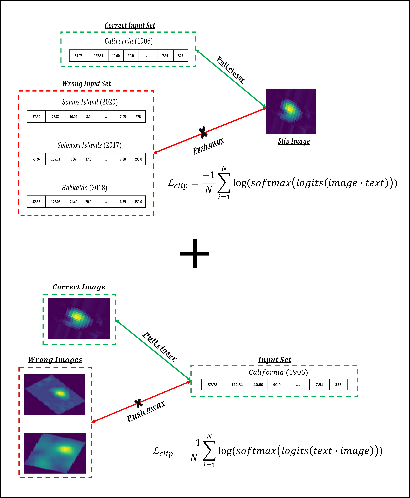
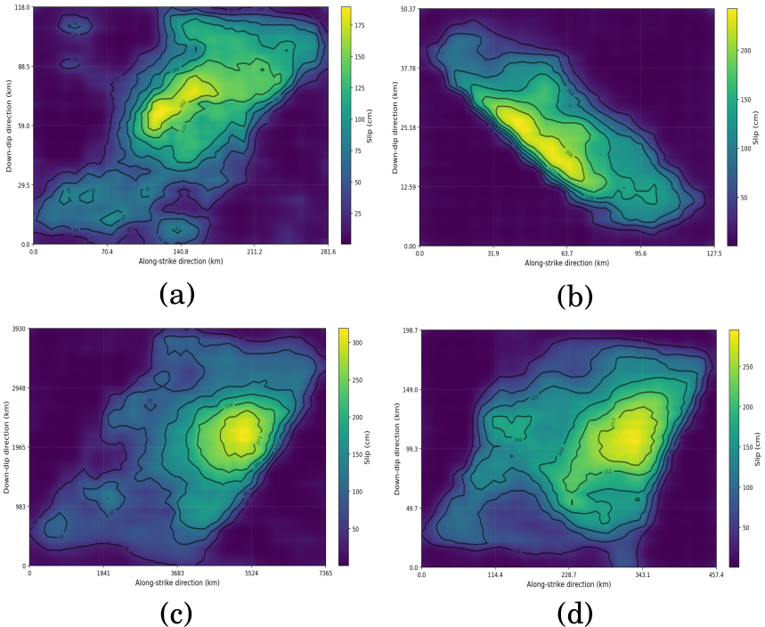

# LATENTFAULTS

<p align="center">
  <b>LATENT-SPACE SURROGATE MODEL FOR EARTHQUAKE SLIP GENERATION</b><br/>
  from sparse source parameters to 2D rupture fields
</p>

<p align="center">
  
  
  
  
</p>

---

## QUICK NAV

- [Project Snapshot](#project-snapshot)
- [System Architecture](#system-architecture)
- [Paper Figures](#paper-figures)
- [Fast Start](#fast-start)
- [Pipeline Runbook](#pipeline-runbook)
- [Artifacts Map](#artifacts-map)
- [Repository Layout](#repository-layout)
- [Reproducibility Notes](#reproducibility-notes)
- [Failure Debug Tree](#failure-debug-tree)
- [Citation](#citation)

---

## Project Snapshot

This repository implements a two-stage generative pipeline:

1. **Representation learning** with VQ-VAE on slip images.
2. **Conditional generation** via parameter-to-latent mapping + decoder reconstruction.

The code accompanies the manuscript:
`Latent Faults: A Latent-Space Surrogate Model for Stochastic Earthquake Slip Generation from Sparse Source Parameters`.

### Reported Manuscript Results (headline)

| Metric block | Reported result |
|---|---|
| Dataset size | 200 SRCMOD events |
| Grid standardization | `50 x 50` |
| 2D PSD correlation | `~0.93` |
| Radial PSD correlation | `~0.96` |

---

## System Architecture

<p align="center">
  
</p>

<p align="center">
  
</p>

---

## Paper Figures

<details>
<summary><b>Contrastive alignment concept (CLIP-style latent loss)</b></summary>
<br/>
<p align="center">
  
</p>
</details>

<details>
<summary><b>Representative generated slip maps (qualitative examples)</b></summary>
<br/>
<p align="center">
  
</p>
</details>

---

## Fast Start

```bash
# 1) environment
python -m venv .venv
source .venv/bin/activate

# 2) dependencies
pip install --upgrade pip
pip install -r requirements.txt

# 3) training + inference
python image_embedder.py
python train_pipeline.py
python inference_pipeline.py
```

Interactive app:

```bash
streamlit run interactive_slip_app.py
```

---

## Pipeline Runbook

<details>
<summary><b>STAGE 0 — Data Contracts (required inputs)</b></summary>

Required by training/inference scripts:

- `Dataset/text_vec.npy`
  - dict-style mapping: `event_key -> feature vector`
- `Dataset/filtered_images_train/`
  - training rupture images (PNG/JPG)
- `Dataset/filtered_images_test/`
  - test rupture images
- `assets/dz.json`
  - event key -> `Dz` value

Optional preprocessing notebooks:
- `Dataset/extracted_dataset/extract_fsp.ipynb`
- `select_features_and_create_dz_json.ipynb`
- `extract_image.ipynb`

</details>

<details>
<summary><b>STAGE 1 — VQ-VAE training + latent extraction</b></summary>

Run:

```bash
python image_embedder.py
```

Expected artifacts:
- `models/vqvae_finetuned.pth`
- `embeddings/image_latents.pkl`

</details>

<details>
<summary><b>STAGE 2 — Optional hyperparameter search</b></summary>

Run:

```bash
python tuning_pipeline.py
```

Expected artifact:
- `models/best_hyperparams.json`

</details>

<details>
<summary><b>STAGE 3 — Parameter -> latent mapper + decoder training</b></summary>

Run:

```bash
python train_pipeline.py
```

Expected artifacts:
- `models/latent_model.pth`
- `models/decoder_model.pth`
- `scaler_x.pkl`
- `plots/` outputs (if plotting enabled)

</details>

<details>
<summary><b>STAGE 4 — Batch inference + metrics</b></summary>

Run:

```bash
python inference_pipeline.py
```

Expected artifacts:
- `Dataset/predicted_images_LAT_LON/`
- `Dataset/slip_arrays_inference/`
- `error_metrics/`
- `test_metrics.json`

</details>

---

## Artifacts Map

| Category | Path(s) | Produced by |
|---|---|---|
| VQ-VAE weights | `models/vqvae_finetuned.pth` | `image_embedder.py` |
| Image latent dictionary | `embeddings/image_latents.pkl` | `image_embedder.py` |
| Mapper/decoder weights | `models/latent_model.pth`, `models/decoder_model.pth` | `train_pipeline.py` |
| Input scaler | `scaler_x.pkl` | `train_pipeline.py` / `input_to_image_embedd.py` |
| Inference arrays | `Dataset/slip_arrays_inference/` | `inference_pipeline.py` |
| Evaluation dumps | `error_metrics/`, `test_metrics.json` | `decoder.py` / `inference_pipeline.py` |

---

## Repository Layout

```text
.
├── Dataset/
│   ├── srcmod2024-12-02FSP/
│   └── extracted_dataset/
├── assets/
│   ├── utils.py
│   └── dz.json
├── models/
│   ├── best_hyperparams.json
│   ├── fixed_hyperparams.json
│   └── fixed_hyperparams_manual.json
├── image_embedder.py
├── input_to_image_embedd.py
├── train_pipeline.py
├── inference_pipeline.py
├── interactive_slip_app.py
├── decoder.py
├── requirements.txt
└── README.md
```

---

## Reproducibility Notes

- Input dimension is inferred from `Dataset/text_vec.npy`; keep feature format stable.
- `scaler_x.pkl` must match the exact model weights used during inference.
- Event-key naming consistency is mandatory across `text_vec.npy`, image filenames, and `assets/dz.json`.
- Slip conversion expects `assets/normalizing_slip_range.npy` (referenced in `assets/utils.py`).
- For strict paper reproduction, align script constants with manuscript hyperparameters (epochs, codebook size, split policy).

---

## Failure Debug Tree

- **Missing file error**
  - verify `Dataset/text_vec.npy`, `models/vqvae_finetuned.pth`, `scaler_x.pkl`, `assets/dz.json`
- **Very low matched samples**
  - check key consistency across `text_vec.npy`, image filenames, and `dz.json`
- **Slip values look wrong**
  - verify `Dz` lookup and `assets/normalizing_slip_range.npy`
- **Unstable train/val behavior**
  - check split policy + hyperparameter configuration alignment between runs

---

## Data Source

- SRCMOD finite-fault database: [https://www.seismo.ethz.ch/static/srcmod/Homepage.html](https://www.seismo.ethz.ch/static/srcmod/Homepage.html)

---

## Citation

```bibtex
@article{nayak2026latentfaults,
  title   = {Latent Faults: A Latent-Space Surrogate Model for Stochastic Earthquake Slip Generation from Sparse Source Parameters},
  author  = {Nayak, Manish and Goswami, Atmadip and Neelamraju, Pavan Mohan and Raghukanth, STG},
  journal = {Manuscript},
  year    = {2026}
}
```

---

## License

No explicit license file is currently present.
Add `LICENSE` before public redistribution.
